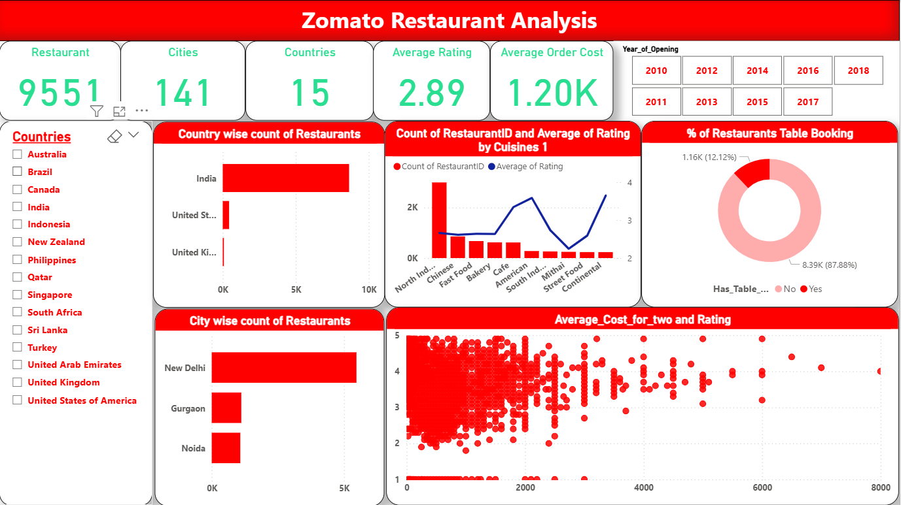

# 🍽️ Zomato Restaurant Analysis Dashboard | Power BI

This project presents an interactive Power BI dashboard based on Zomato’s restaurant dataset, focusing on key business and consumer insights. The dashboard explores restaurant distribution, popular cuisines, service types, and customer ratings across countries and cities.

---

## 📁 File
- `Zomato Dashboard.pbix`: Main Power BI dashboard file

---

## 🎯 Project Objective

The goal of this project is to:
- Identify regional restaurant distribution trends
- Highlight the most popular cuisines globally
- Analyze service types (table booking vs. online delivery)
- Explore how restaurant ratings vary across cuisines and locations

---

## ❓ Key Business Questions Analyzed

### 1️⃣ Which country has the most restaurants listed?
- **Insight:** India has the highest number of restaurants listed, indicating Zomato’s primary market focus.

### 2️⃣ Which cities stand out with the highest number of restaurants?
- **Insight:** Major metropolitan areas like **New Delhi**, **Mumbai**, and **Bangalore** lead in restaurant count.

### 3️⃣ Which cuisine is the most popular based on the count of restaurants?
- **Insight:** North Indian, Fast Food, and Chinese cuisines are the most commonly available.

### 4️⃣ How does average rating vary by cuisine or location?
- **Insight:** Continental and Italian cuisines tend to have higher average ratings. Cities like Bangalore and Mumbai show slightly higher overall customer satisfaction.

### 5️⃣ How many restaurants offer table booking vs. online delivery?
- **Insight:** More restaurants offer **online delivery** than **table booking**, reflecting user preference and operational convenience.

---

## 📊 Dashboard Features

- **Filters**: Country, City,Year of Opening, Cuisine, Service Type
- **KPIs**: Total Restaurants, Avg. Rating, Total Cities, Total Countries, Average Order Cost 
- **Charts**:
  - Country & City-wise restaurant count (Bar)
  - Cuisine popularity (Bar Chart)
  - Rating trends by cuisine (Line and Stacked Column Chart)
  - Table Booking vs. Online Delivery (Donut chart)

---

## 🧩 Tools Used

- Power BI Desktop
- Power Query for data cleaning
- Zomato Restaurant CSV dataset

---

## 📷 Dashboard Screenshot

> A visual overview of restaurant availability, cuisine trends, and service features.

---

## 🗂️ Folder Structure

---

## 📬 Contact

Created by **Atharv Shete**  
🎓 Data Analyst Trainee at AlmaBetter  
📧 sheteatharv1609@gmail.com  
🔗 [GitHub Profile](https://github.com/AtharvShete2610)

---

⭐ *If you found this useful, feel free to give this repo a star!*
